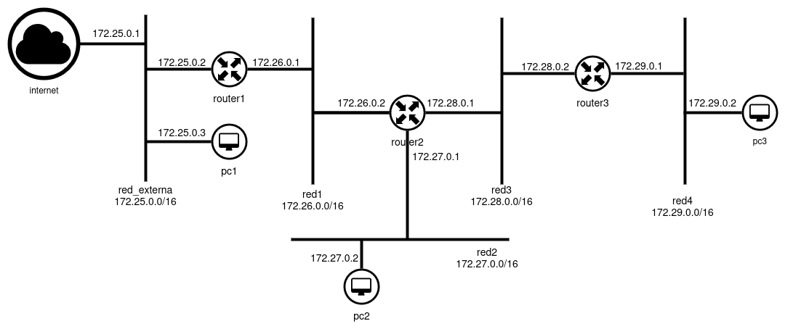

# Docker Routing

Escenario de contenedores Docker para la práctica de enrutamiento de redes. El esquema de red que se va a crear es el siguiente:



Los únicos contenedores que tienen acceso al exterior son los que están conectados a a la `red_externa`, en nuestro caso `pc1` y `router1`.

## Instalación del escenario

Instala docker y docker-compose:

```
sudo apt install docker.io docker-compose
```

Clona este repositorio:

```
git clone https://github.com/josedom24/docker_routing.git
cd docker_routing
```

Todas las instrucciones `docker-compose` hay que ejecutarlas dentro del directorio `docker_routing`, para levantar el escenario:

```
sudo docker-compose up -d
```

Podemos ver los contenedores que se han creado:

```
sudo docker-compose ps
 Name        Command       State   Ports
----------------------------------------
pc1       sleep infinity   Up           
pc2       sleep infinity   Up           
pc3       sleep infinity   Up           
router1   sleep infinity   Up           
router2   sleep infinity   Up           
router3   sleep infinity   Up           
```

Para acceder a un contenedor:

```
sudo docker exec -it <nombre_contenedor> bash
```

Por ejemplo:

```
sudo docker exec -it pc1 bash
root@pc1:/# 
```

Docker incluye reglas de cortafuego muy estrictas que evitan el tráfico entre redes docker. Para poder trabajar con enrutamiento necesitamos quitar estas reglas, para ello ejecutamos en el ordenador donde hemos instalado docker estas instrucciones (si es necesario tendrás que instalar el paquete `iptables`):

```
sudo iptables -I DOCKER-ISOLATION-STAGE-1 1 -j RETURN
sudo iptables -P FORWARD ACCEPT
```

Después de trabajar con el escenario, puedes destruirlo con:

```
sudo docker-compose down
```

## Explicación detallada del fichero docker-compose

1. Cuando se crean los contenedores se crea una nueva imagen llamada `midebian:latest` ejecutando el fichero `Dockerfile` que encuentras en el directorio `build`. Esta imagen se bas en la imagen `debian` pero se le instalan los paquetes necesarios para nuestro ejercicio de enrutamiento. Si al finalizar queremos borrar las imágenes, ejecutaremos:
    ```
    sudo docker rmi debian:latest
    sudo docker rmi midebian:latest
    ```
2. Se crean 5 redes docker:
    * La red llamada `red_externa` es la única que permite acceso al exterior, es decir, los contenedores conectadas a ella (`router1` y `pc1`) tienen una ruta por defecto a la puerta de enlace `172.25.0.1` que permite el acceso a exterior.
    * Las redes `redX` están configuradas como redes internas (`internal: true`), esto significa que los contenedores conectados a ellos tengan un ruta por defecto a la puerta de enlace `172.XX.0.254` (hemos indicado esa puerta de enlace para que podamos usar las direcciones 172.XX.0.1) no tienen conectividad al exterior.

3. Se crean 6 contenedores:
    * `routerX`: Son contenedores que tienen el rol de router y están conectados a varias redes. Se ha activada el bit de forwarding (`sysctls: net.ipv4.ip_forward: "1"`) para que enrruten paquetes.
    * `pcX`: Son contenedores que hacen de equipos conectados a las redes.

4. En el parámetro `networks` de la definición de cada contenedor encontramos a que red está conectado y con qué ip se va a configurar.
